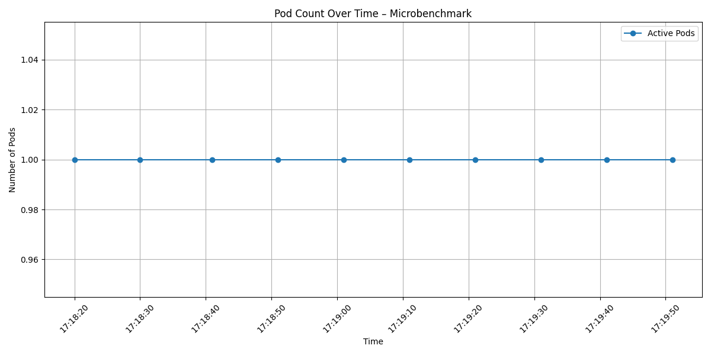
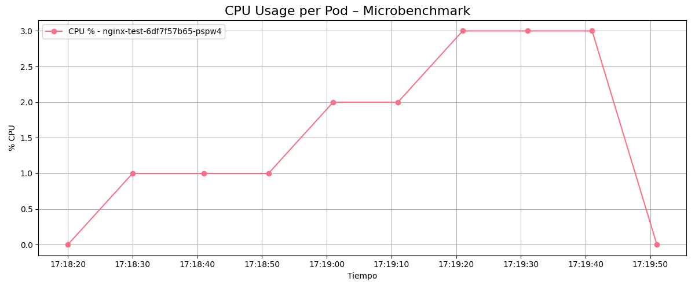

# 🧪 Microbenchmark de Elasticidad: NGINX

Este documento describe el experimento de microbenchmark realizado para estimar el consumo de CPU por solicitud y por usuario virtual (VU) en un microservicio NGINX. Este experimento constituye un **paso previo esencial** para estructurar correctamente los análisis de elasticidad en escenarios más complejos.

La estimación de consumo de recursos bajo carga controlada permite convertir métricas de carga abstractas (como el número de usuarios virtuales o el número de solicitudes) en una estimación directa de **demanda de CPU en millicores**. Esta conversión es crítica para construir curvas de demanda esperada y, con base en ellas, poder comparar la oferta real del sistema durante los experimentos de elasticidad.

Se eligió NGINX como microservicio base por su **simplicidad, predictibilidad y baja latencia**, lo que permite centrarse en la dinámica de consumo de recursos sin introducir variabilidad innecesaria.

El microbenchmark se ejecuta en el **mismo entorno de Kubernetes local** que se utiliza en los experimentos principales, incluyendo la presencia de un HPA (Horizontal Pod Autoscaler), lo que garantiza que los resultados obtenidos sean completamente consistentes con el resto del sistema.

---

## 🎯 Objetivo del experimento

El propósito principal es estimar cuántos **millicores de CPU** consume el sistema bajo condiciones de carga controlada. En particular, se busca obtener:

- 🧮 **Millicores por request**
- 👤 **Millicores por usuario virtual (VU)**

Estos valores servirán como entrada directa para calcular la demanda de recursos (*resource demand*) en los experimentos de elasticidad, y son clave para habilitar el cálculo de métricas como:

- Precisión de escalado
- Tiempos acumulados en sub/sobreaprovisionamiento
- Métricas de elasticidad hacia arriba, hacia abajo y global

---

## 🧩 Descripción general del sistema

Este microbenchmark fue diseñado para ejecutarse en el mismo entorno de pruebas que los experimentos de elasticidad: un **cluster de Kubernetes local** con soporte para escalamiento automático mediante **Horizontal Pod Autoscaler (HPA)**. Aunque en esta prueba el escalamiento no se activa (por el bajo nivel de carga), el HPA permanece activo para mantener coherencia con el resto del sistema.

El flujo de software se basa en una arquitectura simple pero representativa:

| Componente         | Rol en el experimento                              |
|--------------------|----------------------------------------------------|
| **NGINX**          | Microservicio bajo prueba                          |
| **K6**             | Generador de carga controlada                      |
| **Kubernetes**     | Plataforma de orquestación                         |
| **HPA**            | Escalador automático (activo pero sin efecto aquí) |
| **Scripts Bash**   | Automatización de recolección y análisis           |
| **Python + Docker**| Análisis de resultados                             |

### 🔹 Condiciones experimentales

- Carga constante: **10 usuarios virtuales (VUs)** durante **1 minuto**
- No se espera escalamiento: el uso de CPU no debería superar el umbral del HPA
- Observación principal: consumo de CPU y número de pods durante la prueba
- Recolección periódica de métricas: cada **10 segundos**

Esta configuración permite capturar de manera precisa la relación entre la carga generada y los recursos consumidos, bajo un entorno idéntico al que se utilizará en los análisis de elasticidad posteriores.

---

## 🔄 Flujo del experimento

El microbenchmark sigue una secuencia clara y automatizada de pasos, cuyo objetivo es generar carga controlada, recolectar métricas relevantes y procesarlas para obtener estimaciones clave.

| Paso | Descripción técnica |
|------|---------------------|
| 1️⃣   | **Despliegue del microservicio**: se aplican los manifiestos de Kubernetes (`deployment.yaml` y `hpa.yaml`) para iniciar el pod de NGINX junto con su autoscaler. |
| 2️⃣   | **Inicio del recolector de métricas**: un script en Bash ejecuta la captura periódica del uso de CPU por pod y el número de réplicas activas, guardando esta información en CSV. |
| 3️⃣   | **Ejecución de la carga**: se lanza el script `benchmark_test.js` con K6, simulando 10 usuarios virtuales generando solicitudes de forma constante durante 1 minuto. |
| 4️⃣   | **Finalización de la recolección**: el script de captura se detiene después de la prueba, asegurando que se hayan registrado todas las métricas necesarias. |
| 5️⃣   | **Análisis de resultados**: un contenedor Docker ejecuta el script `analyze_microbenchmark.py`, que combina las métricas de uso de CPU con los resultados de K6 para calcular las estimaciones finales. |

Este flujo completo puede ejecutarse de forma automática mediante el script `exp0_microbenchmark.sh`, lo que asegura reproducibilidad y facilita futuras repeticiones del experimento.

---

## ⚙️ Configuraciones utilizadas

A continuación se detallan las configuraciones clave utilizadas durante el experimento. Todas ellas están contenidas en la carpeta `files/microbenchmark/`.

---

### 📦 Manifiestos de Kubernetes

Ubicación: `files/microbenchmark/manifests/`

- **`deployment.yaml`**: Define el despliegue de un pod con NGINX. Establece los `requests` y `limits` de CPU requeridos por el HPA.
- **`hpa.yaml`**: Configura un Horizontal Pod Autoscaler con umbral de CPU objetivo del 25% y un rango de entre 1 y 10 réplicas. Aunque no se espera escalamiento en esta prueba, se mantiene activo por coherencia con el resto del sistema.

---

### 🧪 Script de carga (K6)

Ubicación: `files/microbenchmark/loadtest/benchmark_test.js`

Genera una carga constante de 10 usuarios virtuales durante 1 minuto. Este patrón permite observar el comportamiento del consumo de recursos bajo condiciones estables, sin variaciones bruscas de tráfico.

---

### 🧾 Recolección de métricas

Ubicación: `files/microbenchmark/scripts/metric_collector_microbenchmark.sh`

Este script captura métricas cada 10 segundos durante la prueba, incluyendo:

- Uso de CPU por pod (en millicores)
- Uso relativo de CPU (en porcentaje)
- Número de pods activos

Los datos recolectados se almacenan en un archivo CSV (`microbenchmark_metrics.csv`) para su posterior análisis.

---

### 📊 Scripts de análisis y visualización (Python)

Ubicación: `files/microbenchmark/analysis/`

Después de la ejecución de la prueba, los datos recolectados son procesados automáticamente por una serie de scripts en Python contenidos en esta carpeta. Su propósito es calcular métricas clave y generar visualizaciones útiles para evaluar el consumo de recursos.

- **`analyze_microbenchmark.py`**  
  Script principal de análisis. Lee el resumen de carga (`k6_summary.json`) y las métricas del sistema (`microbenchmark_metrics.csv`) para calcular:
  - CPU total utilizada (millicores)
  - CPU por request
  - CPU por VU  
  Los resultados se exportan como archivos de texto (`microbenchmark_summary.txt`) y CSV (`microbenchmark_summary.csv`).

- **`plot_cpu_usage.py`**  
  Genera una gráfica temporal del uso de CPU (en porcentaje) para los pods activos. Permite observar la estabilidad y carga efectiva del sistema.

- **`plot_pod_count.py`**  
  Produce una gráfica del número de pods activos a lo largo del tiempo. Verifica que no haya habido escalamiento accidental durante la prueba.

- **`requirements.txt`**  
  Lista de dependencias necesarias para ejecutar los scripts (`pandas`, `matplotlib`, entre otras).

- **`Dockerfile`**  
  Define la imagen Docker utilizada para ejecutar todo el análisis en un entorno limpio y reproducible. Esto elimina la necesidad de instalar dependencias localmente y asegura que los resultados sean consistentes.

---

Estas herramientas complementan el entorno de ejecución, permitiendo transformar datos crudos en métricas cuantificables y visualizaciones interpretables, todo de forma automática.

---

## 🔢 Cálculo de estimaciones

El objetivo principal del microbenchmark es obtener estimaciones confiables sobre el consumo de CPU por unidad de carga. Estas estimaciones permiten transformar medidas abstractas como "cantidad de usuarios virtuales" o "número de solicitudes" en una **demanda de recursos cuantificable en millicores**, lo que resulta indispensable para construir curvas de elasticidad y evaluar el desempeño del autoscaler.

El proceso de cálculo está totalmente automatizado mediante el script `analyze_microbenchmark.py`, que integra las métricas recolectadas desde Kubernetes y los resultados de carga generados por K6.

---

### 📌 Fuentes de datos utilizadas

- **`microbenchmark_metrics.csv`**  
  Contiene muestras del uso de CPU (en millicores) y el número de pods activos recolectadas cada 10 segundos durante el experimento.

- **`k6_summary.json`**  
  Archivo JSON generado automáticamente por K6, donde se registran:
  - El número total de solicitudes procesadas (`requests`)
  - El número máximo de usuarios virtuales (`vus_max`)
  - La duración total de la prueba

---

### 📐 Estimaciones calculadas

A partir de estas dos fuentes, se derivan las siguientes métricas clave:

#### 1. **CPU total utilizada**

Esta métrica representa la cantidad total de recursos de CPU consumidos (en millicores) durante todo el experimento. Se obtiene a partir del archivo `microbenchmark_metrics.csv`, donde se recolecta el uso de CPU por pod cada 10 segundos.

Para calcular esta métrica, se suman todos los valores registrados en la columna `cpu(millicores)`:

Código relevante del script `analyze_microbenchmark.py`:
```python
cpu_total_millicores = df["cpu(millicores)"].sum()
```

#### 2. **CPU por solicitud (millicores/request)**

Esta métrica estima cuántos millicores de CPU se consumen, en promedio, por cada solicitud HTTP enviada al sistema. Es fundamental para generar curvas de demanda basadas en tráfico.

El valor del número total de solicitudes (`total_requests`) se obtiene del archivo `k6_summary.json`, generado por la herramienta K6 al finalizar la prueba:
```python
total_requests = k6_data["metrics"]["http_reqs"]["count"]
```

Cálculo:
```python
cpu_per_request = cpu_total_millicores / total_requests if total_requests else 0
```

Esta estimación es útil para construir una curva de demanda basada en el volumen de tráfico (requests por segundo), independientemente del número de usuarios virtuales.

#### 3. **CPU por usuario virtual (millicores/VU)**

Esta métrica estima el consumo promedio de CPU por cada usuario virtual activo durante la prueba. Es útil cuando se modela la carga en términos de usuarios concurrentes.

El número máximo de usuarios virtuales (`vus_max`) también se extrae desde `k6_summary.json`:
```python
vus_max = int(k6_data["metrics"]["vus_max"]["value"])
```

Cálculo:
```python
cpu_per_vu = cpu_total_millicores / vus_max if vus_max else 0
```

Resulta útil cuando la carga del sistema se modela en términos de usuarios concurrentes, como suele hacerse en herramientas de pruebas de carga o simulaciones de comportamiento de usuarios.

---

### 📝 Exportación de resultados

Una vez calculadas, las estimaciones son exportadas en los siguientes formatos:

- **`microbenchmark_summary.txt`**: resumen legible para revisión manual o presentación
- **`microbenchmark_summary.csv`**: archivo estructurado en formato tabular para uso automatizado en experimentos posteriores

Estas salidas sirven como **insumo directo** para calcular la *demanda de recursos* en experimentos de elasticidad, permitiendo generar curvas teóricas de demanda que luego se comparan con la oferta observada por el sistema en producción.

---

### 💡 Relevancia del cálculo

Este proceso es fundamental porque permite estimar, de forma cuantificable, la demanda de CPU asociada a una carga determinada. Sin estas métricas, no sería posible transformar el comportamiento observado del sistema (usuarios o requests) en una estimación concreta del consumo de recursos. Estas estimaciones son el insumo base para evaluar si el sistema está correctamente aprovisionado en pruebas de elasticidad.


---

## 📊 Resultados obtenidos

Tras ejecutar el microbenchmark sobre el microservicio NGINX, se obtuvieron los siguientes valores a partir del análisis automático realizado por el script `analyze_microbenchmark.py`.

> ⚠️ **Importante:** Estos valores corresponden a una ejecución específica sobre un microservicio concreto (NGINX) bajo carga controlada. Los resultados pueden variar significativamente dependiendo del tipo de aplicación, su comportamiento interno, la configuración de recursos y el entorno de despliegue. Por lo tanto, se recomienda repetir este microbenchmark para cada microservicio que se desee evaluar.

---

### 📈 Resumen numérico

| Métrica                     | Valor                          | Interpretación |
|----------------------------|--------------------------------|----------------|
| Total de requests          | 303 solicitudes                | Cantidad total de solicitudes procesadas durante el experimento. |
| Máximo de usuarios virtuales (VU) | 10                            | Número de VUs activos generando carga durante toda la prueba. |
| CPU total utilizada        | 15.00 millicores               | Suma del uso de CPU reportado por Kubernetes a lo largo de la prueba. |
| CPU por solicitud          | 0.05 millicores/request        | Promedio de millicores necesarios para atender una solicitud individual. |
| CPU por usuario virtual    | 1.50 millicores/VU             | Promedio de millicores consumidos por cada VU activo. |

Estas métricas permiten cuantificar la *demanda de recursos* del microservicio y son fundamentales para modelar correctamente escenarios de elasticidad.

---

### 📊 Gráficas generadas

A continuación se analizan las gráficas generadas durante la ejecución:

---

#### 🔹 Número de pods activos



Este gráfico muestra que durante toda la duración del experimento el número de pods activos fue constante e igual a **1**. Esto era esperable, ya que:

- El HPA estaba configurado pero no se alcanzó el umbral de uso de CPU (25%) que desencadenaría el escalado.
- La carga generada fue deliberadamente baja (10 VUs) para mantener el sistema estable.

**Interpretación:**  
La ausencia de escalamiento confirma que el sistema operó en un rango de carga estable y bajo aprovisionamiento controlado, ideal para extraer mediciones precisas sin interferencias.

---

#### 🔹 Uso relativo de CPU (%)



Este gráfico muestra el porcentaje de uso de CPU del pod de NGINX a lo largo del tiempo.

- Se observa un aumento progresivo en el consumo, estabilizándose alrededor del **3% de uso** en la segunda mitad de la prueba.
- La caída al final corresponde al término de la carga generada.

**Interpretación:**  
El consumo gradual de CPU refleja un comportamiento estable y predecible del microservicio. La baja utilización confirma que la carga generada no exigió el escalamiento, pero sí permitió detectar consumo real, suficiente para derivar las métricas de demanda.

---

Los resultados numéricos y visuales muestran que el sistema respondió de manera estable y controlada, lo que valida la calidad del experimento. Las métricas obtenidas permitirán construir curvas de demanda realistas en futuras pruebas de elasticidad y calcular indicadores como la precisión del escalado y los tiempos de sobre/subaprovisionamiento.

---

## 📁 Estructura del experimento

A continuación se muestra la organización del experimento dentro del directorio `files/microbenchmark/`. Esta estructura agrupa todos los componentes necesarios para ejecutar, monitorear y analizar el microbenchmark de forma modular y ordenada.

```
files/microbenchmark/
├── manifests/                            # Archivos YAML para despliegue
│   ├── deployment.yaml                   # Deployment del pod nginx con requests/limits
│   └── hpa.yaml                          # Autoscaler HPA con CPU objetivo = 25%
├── scripts/
│   ├── metric_collector_microbenchmark.sh # Recolector de CPU y n. de pods
│   └── benchmark_test.js                # Script k6 para generar carga controlada
├── files/        
│   └──                                     
└── analysis/
    ├── files/
    │   ├── microbenchmark_metrics.csv        
    │   ├── microbenchmark_summary.txt        
    ├── images/
    │   ├── cpu_pod/
    │   │   └── pod1_cpu.png
    │   ├── cpu_usage_per_pod.png           # Grafica sobre el uso de CPU por pod 
    │   └── pod_count_over_time.png        # Grafica de pods a traves del tiempo
    ├── plot_cpu_usage.py                 # Genera gráfico de uso de CPU por pod
    ├── plot_pod_count.py                 # Gráfico del n. de pods activos
    ├── analyze_microbenchmark.py         # Calcula CPU/request y CPU/VU
    ├── requirements.txt                  # Dependencias Python
    └── Dockerfile                        # Contenedor para ejecutar análisis
```

Esta organización permite:
- Acceder de forma ordenada a métricas, resultados y visualizaciones
- Facilitar el mantenimiento y reutilización del experimento para otros microservicios

---

## 🤖 Automatización del proceso

La ejecución del microbenchmark puede realizarse de forma manual o completamente automatizada mediante un script Bash. A continuación se presentan ambas alternativas.

---

### 🧭 Ejecución manual paso a paso

Si se desea ejecutar el microbenchmark sin utilizar automatización, los siguientes comandos deben ejecutarse en orden para replicar el flujo completo:

1. **Aplicar manifiestos en Kubernetes:**
   ```bash
   kubectl apply -f microbenchmark/manifests/deployment.yaml
   kubectl apply -f microbenchmark/manifests/hpa.yaml
   ```
   Esto despliega el pod NGINX con configuración de CPU y activa el HPA.

2. **Esperar a que el pod se inicialice correctamente:**
   ```bash
   sleep 20
   ```

3. **Obtener la IP del clúster y actualizar el script de carga:**
   ```bash
   kubectl get nodes -o wide
   # Editar manualmente 'benchmark_test.js' y reemplazar <IP_DEL_CLUSTER>
   ```

4. **Iniciar el recolector de métricas en segundo plano:**
   ```bash
   bash microbenchmark/scripts/metric_collector_microbenchmark.sh &
   METRIC_PID=$!
   ```

5. **Ejecutar la prueba con K6:**
   ```bash
   k6 run --summary-export microbenchmark/output/k6_summary.json \
     microbenchmark/scripts/benchmark_test.js
   ```

6. **Esperar para capturar la estabilización post-carga:**
   ```bash
   sleep 30
   ```

7. **Finalizar el recolector de métricas:**
   ```bash
   kill $METRIC_PID
   ```

8. **Ejecutar análisis automático con Docker:**
   ```bash
   docker build -t microbenchmark-analysis microbenchmark/analysis
   docker run --rm \
     -v "$(pwd)/microbenchmark/output:/app/output" \
     -v "$(pwd)/microbenchmark/analysis/files:/app/files" \
     -v "$(pwd)/microbenchmark/analysis/images:/app/images" \
     microbenchmark-analysis
   ```

9. **Eliminar los recursos desplegados en Kubernetes:**
   ```bash
   kubectl delete -f microbenchmark/manifests/deployment.yaml
   kubectl delete -f microbenchmark/manifests/hpa.yaml
   ```

---

### 🧪 Ejecución automática con `exp0_microbenchmark.sh`

Todo el flujo descrito anteriormente ha sido encapsulado en el script `exp0_microbenchmark.sh`, ubicado en la raíz del directorio `files/`.

Este script realiza las siguientes acciones:

1. Despliega NGINX y su HPA en Kubernetes.
2. Solicita al usuario que actualice la IP en el script de carga.
3. Inicia el recolector de métricas.
4. Ejecuta la prueba con K6.
5. Detiene el recolector.
6. Ejecuta el análisis completo en Docker.
7. Limpia los recursos del clúster.

#### 📍 Ubicación del script

```
files/exp0_microbenchmark.sh
```

#### ▶️ Instrucciones de uso

> ⚠️ **Requisito importante:** el script debe ejecutarse desde la raíz del proyecto (`elasticity-m1`) para que las rutas relativas funcionen correctamente.

```bash
cd elasticity-m1/files
bash exp0_microbenchmark.sh
```

Al finalizar, el script imprime la ubicación de todos los archivos generados:

- CSV de métricas recolectadas
- Resumen de carga
- Estimaciones en `.txt` y `.csv`
- Gráficos generados en `images/`

Esta automatización permite repetir el experimento de forma rápida, consistente y sin errores manuales, incluso en diferentes entornos o microservicios.

