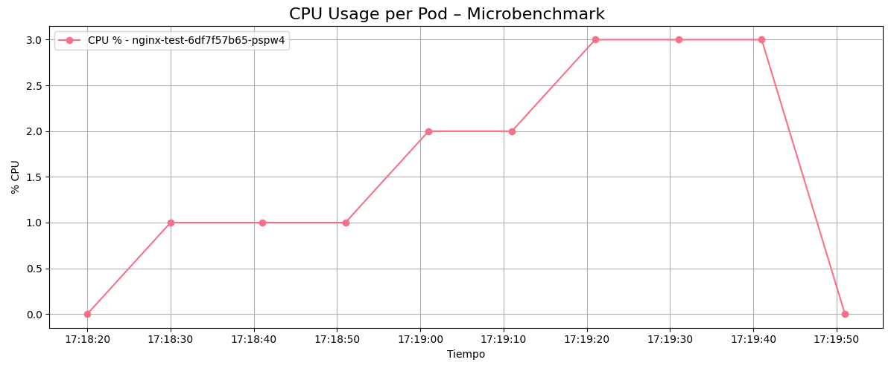
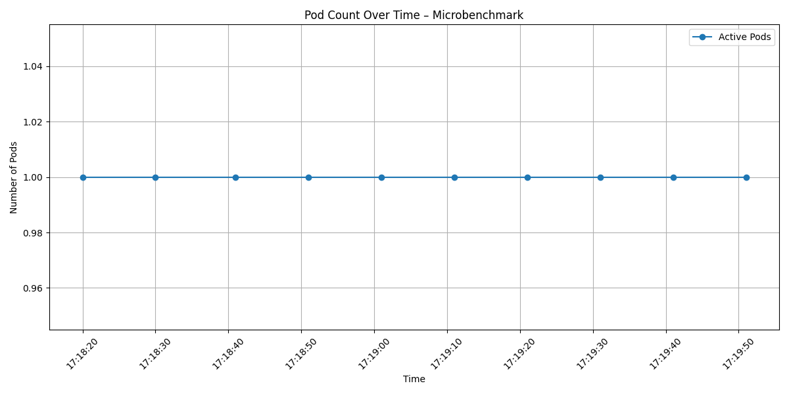

# 🧪 02 - Microbenchmark de Elasticidad: NGINX

Este documento describe el experimento de microbenchmark realizado para estimar el uso de CPU por solicitud y por usuario virtual en un microservicio NGINX. Este paso es fundamental para calcular la *resource demand* en pruebas posteriores de elasticidad.

---

## 🌟 Objetivo del experimento

- Obtener una referencia del consumo real de CPU en condiciones controladas.
- Estimar:
  - Millicores utilizados por *request*.
  - Millicores utilizados por *usuario virtual* (VU).

Esta información se usará como insumo para construir la curva de demanda esperada en futuros experimentos.

---

## ⚙️ Arquitectura del experimento

- **Microservicio**: NGINX
- **Cluster**: Kubernetes local (usando HPA)
- **Generador de carga**: k6
- **Métricas recolectadas**: CPU por pod, número de pods
- **Duración de la prueba**: 1 minuto de carga constante (10 VUs)

---

## ♻️ Flujo del experimento

| Paso | Descripción |
|------|-------------|
| 1. | Despliegue de NGINX y HPA en Kubernetes |
| 2. | Iniciación de script de recolección de métricas |
| 3. | Ejecución de prueba con k6 (`benchmark_test.js`) |
| 4. | Finalización de captura de métricas |
| 5. | Análisis automático con Python dentro de Docker |

---

## 📦 Configuraciones utilizadas

### Manifiestos Kubernetes (ubicados en `files/microbenchmark/manifests/`):

- `deployment.yaml`: Despliegue del pod NGINX con requests y limits definidos, necesario para que el HPA pueda actuar correctamente.
- `hpa.yaml`: Define un autoscaler con métrica basada en uso promedio de CPU (25%) y límites de réplicas.

### Script de carga (`benchmark_test.js`):
Ubicado en `files/microbenchmark/loadtest/`, genera carga constante:
```js
stages: [
  { duration: '1m', target: 10 },
]
```
Esto simula 10 usuarios virtuales haciendo peticiones continuas durante 1 minuto.

### Recolección de métricas:
Script: `metric_collector_microbenchmark.sh`
Ubicado en: `files/microbenchmark/scripts/`

Recolección cada 10 segundos de:
- CPU por pod (millicores)
- Uso relativo de CPU (%)
- Número de pods activos

---

## 🔢 Cálculo de estimaciones

El script `analyze_microbenchmark.py` fusiona las métricas de k6 (`k6_summary.json`) con las métricas de Kubernetes (`microbenchmark_metrics.csv`) y calcula:

- CPU total utilizada:
```python
cpu_total_millicores = df["cpu(millicores)"].sum()
```
- CPU por request:
```python
cpu_per_request = cpu_total_millicores / total_requests
```
- CPU por VU:
```python
cpu_per_vu = cpu_total_millicores / vus_max
```

Estos valores se guardan en:
- Texto: `files/microbenchmark_summary.txt`
- CSV estructurado: `files/microbenchmark_summary.csv`

---

## 📊 Resultados obtenidos

### Resumen generado por `analyze_microbenchmark.py`

| Métrica                | Valor                        |
|------------------------|------------------------------|
| Total de requests      | 303                          |
| Máximo de VUs          | 10                           |
| CPU total utilizada    | 15.00 millicores             |
| CPU por request        | 0.05 millicores/request      |
| CPU por VU             | 1.50 millicores/VU           |

### Gráficos generados

📍 `images/cpu_usage_per_pod.png`

Este gráfico muestra la evolución del uso relativo de CPU (%) para el pod activo durante el experimento. Se observa un patrón de consumo suave y sostenido, lo que respalda la estabilidad del microservicio:



📍 `images/pod_count_over_time.png`

Este gráfico refleja que durante toda la prueba se mantuvo activo un solo pod. Esto era esperable ya que el uso de CPU nunca superó el umbral del HPA:



---

## 📁 Estructura del experimento

```
files/microbenchmark/
├── manifests/                            # Archivos YAML para despliegue
│   ├── deployment.yaml                   # Deployment del pod nginx con requests/limits
│   └── hpa.yaml                          # Autoscaler HPA con CPU objetivo = 25%
├── loadtest/
│   └── benchmark_test.js                # Script k6 para generar carga controlada
├── scripts/
│   └── metric_collector_microbenchmark.sh # Recolector de CPU y n. de pods
├── output/
│   ├── microbenchmark_metrics.csv        # Métricas recolectadas por el script
│   └── k6_summary.json                   # Resumen de carga generado por k6
├── files/
│   ├── microbenchmark_summary.txt        # Resultados legibles por humanos
│   └── microbenchmark_summary.csv        # Resultados estructurados en una fila CSV
└── analysis/
    ├── plot_cpu_usage.py                 # Genera gráfico de uso de CPU por pod
    ├── plot_pod_count.py                 # Gráfico del n. de pods activos
    ├── analyze_microbenchmark.py         # Calcula CPU/request y CPU/VU
    ├── requirements.txt                  # Dependencias Python
    └── Dockerfile                        # Contenedor para ejecutar análisis
```

---

## ✅ Conclusiones

A partir del microbenchmark realizado se obtuvieron los siguientes valores clave:

| Métrica                  | Valor                         |
|--------------------------|-------------------------------|
| CPU por solicitud        | 0.05 millicores/request       |
| CPU por usuario virtual  | 1.50 millicores/VU            |
| Número de pods activos   | 1 (sin escalar)               |
| Consumo total observado  | 15 millicores                 |

Estos valores servirán como base para definir la demanda estimada en futuros experimentos de elasticidad. La prueba también valida el funcionamiento del sistema de recolección y análisis automatizado.

---

## 🤖 Automatización del proceso

Todo el proceso descrito en este documento puede ejecutarse automáticamente mediante el script `exp0_microbenchmark.sh`, ubicado en la carpeta `files/`.

### 📍 Ubicación
```
files/exp0_microbenchmark.sh
```

### ▶️ Ejecución
Este script debe ejecutarse desde dentro de la carpeta `files/`:
```bash
cd files/
bash exp0_microbenchmark.sh
```

### 🔄 Qué realiza automáticamente

1. Aplica los manifiestos en Kubernetes:
```bash
kubectl apply -f microbenchmark/manifests/deployment.yaml
kubectl apply -f microbenchmark/manifests/hpa.yaml
```

2. Solicita al usuario actualizar la IP del clúster en el script de k6.

3. Lanza el recolector de métricas en segundo plano:
```bash
bash microbenchmark/scripts/metric_collector_microbenchmark.sh &
```

4. Ejecuta la prueba con k6 y exporta resumen:
```bash
k6 run --summary-export output/k6_summary.json microbenchmark/loadtest/benchmark_test.js
```

5. Espera y luego finaliza el recolector:
```bash
kill $METRIC_PID
```

6. Construye y ejecuta el contenedor de análisis:
```bash
docker build -t microbenchmark-analysis microbenchmark/analysis

docker run --rm \
  -v "$(pwd)/microbenchmark/output:/app/output" \
  -v "$(pwd)/microbenchmark/analysis/files:/app/files" \
  -v "$(pwd)/microbenchmark/analysis/images:/app/images" \
  microbenchmark-analysis
```

7. Limpia los recursos de Kubernetes:
```bash
kubectl delete -f microbenchmark/manifests/
```

Este enfoque garantiza reproducibilidad, facilita la recolección de datos y reduce errores humanos durante la ejecución del experimento.

