# 🧪 Resultados del experimento `exp1_basic-autoscaling`

Este documento presenta los resultados obtenidos tras la ejecución del experimento de elasticidad `exp1_basic-autoscaling`, el cual evalúa la respuesta del sistema ante una carga progresiva utilizando el escalamiento automático basado en uso de CPU (HPA).

Se incluyen visualizaciones detalladas del comportamiento del sistema (uso de CPU, número de pods, curvas de elasticidad, etc.) así como métricas cuantitativas que permiten analizar la eficiencia, precisión y adaptabilidad del mecanismo de escalado configurado.

Los datos y gráficos aquí mostrados han sido generados automáticamente a partir de los logs recolectados y procesados por los scripts incluidos en la carpeta `analysis/` del proyecto.

---

## 📈 Gráficos de comportamiento

En esta sección se presentan los principales gráficos generados a partir del experimento, que permiten visualizar cómo varió el comportamiento del sistema a lo largo del tiempo. Estos gráficos son esenciales para comprender:

- Cómo reaccionaron los pods al aumento y disminución de carga.
- Cuándo ocurrieron los eventos de escalamiento.
- Cómo se distribuyó el uso de CPU entre las réplicas activas.

---

### 🔸 Uso de CPU por pod

Estos gráficos muestran el porcentaje de uso de CPU de los pods NGINX desplegados durante la prueba. El HPA toma decisiones basadas en el promedio de uso de CPU, por lo tanto, observar estos valores por pod permite entender cómo y cuándo el sistema decide escalar.

#### 🔹 Uso combinado de CPU por todos los pods

- **cpu_usage_per_pod.png**  
  Este gráfico muestra el uso de CPU agrupado por pod a lo largo del tiempo. Se observa un aumento progresivo hasta que se alcanza el pico de carga, seguido por una disminución controlada que refleja la reducción de usuarios virtuales.

  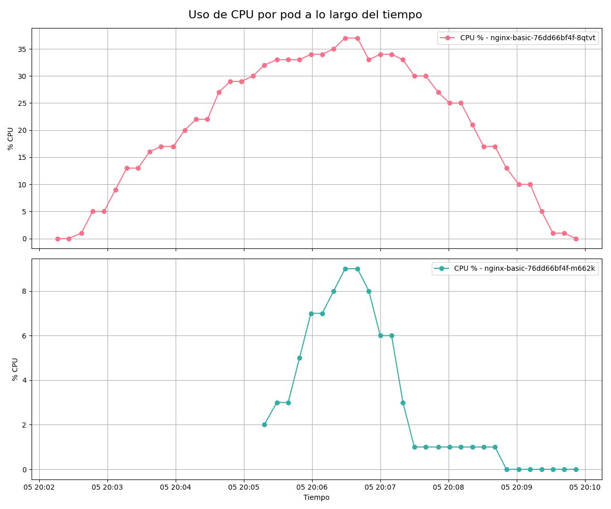

- **cpu_usage_per_pod_with_events.png**  
  Es la misma visualización anterior pero incluye anotaciones visuales (líneas verticales) que indican los eventos de escalamiento ocurridos. Esto permite correlacionar el aumento/disminución de uso de CPU con la acción del HPA.

  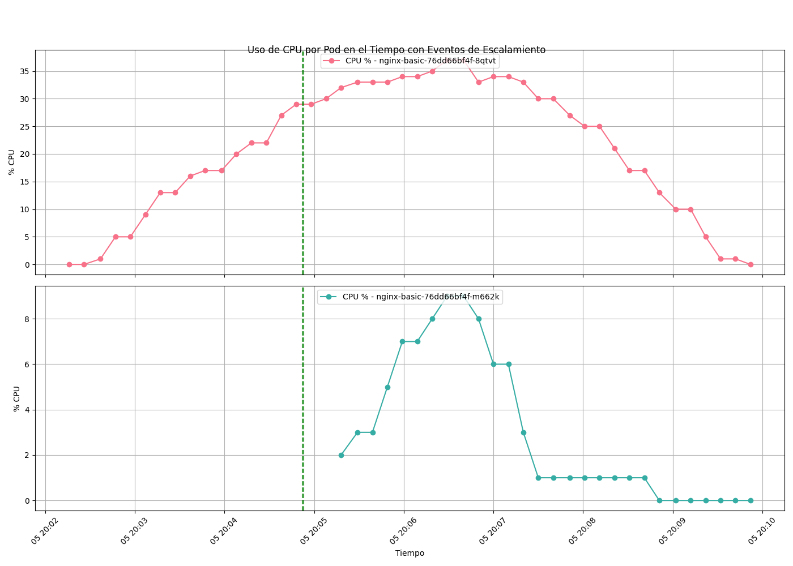

#### 🔹 Uso de CPU individual por pod

- **pod1_cpu.png** y **pod2_cpu.png**  
  Estos gráficos permiten observar cómo se comportó cada pod individual. Pod1 absorbe la carga inicial y permanece activo durante gran parte del experimento. Pod2 se activa posteriormente cuando el HPA escala el sistema, y se observa su participación en la distribución de carga.

  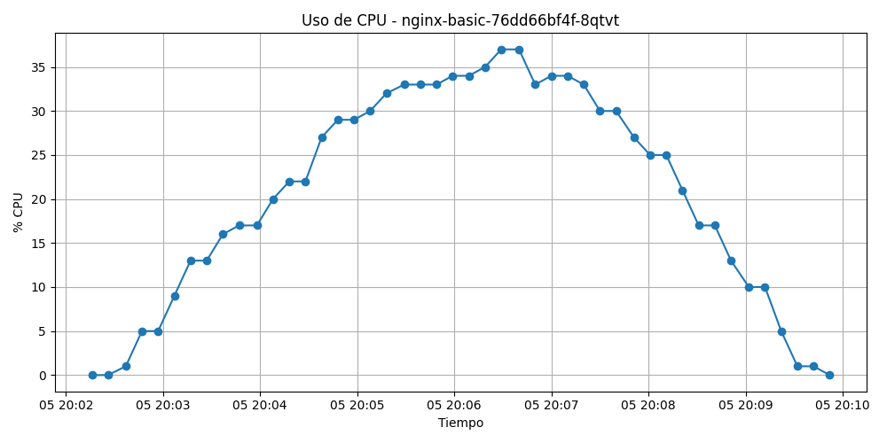
  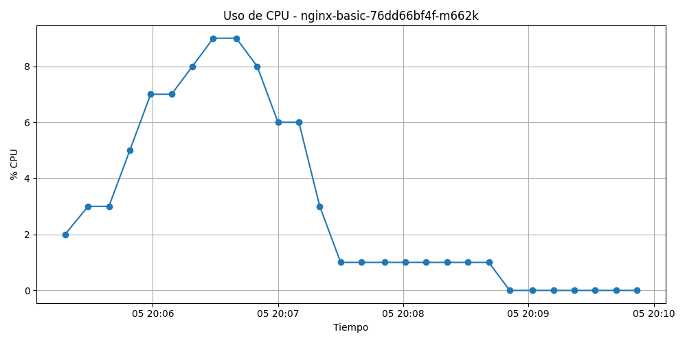

- **pod1_cpu_with_events.png** y **pod2_cpu_with_events.png**  
  Aquí se visualiza el mismo comportamiento anterior, pero añadiendo los eventos de escalamiento, lo que ayuda a identificar con precisión cuándo fue creado o eliminado cada pod y cómo impactó en su uso de CPU.

  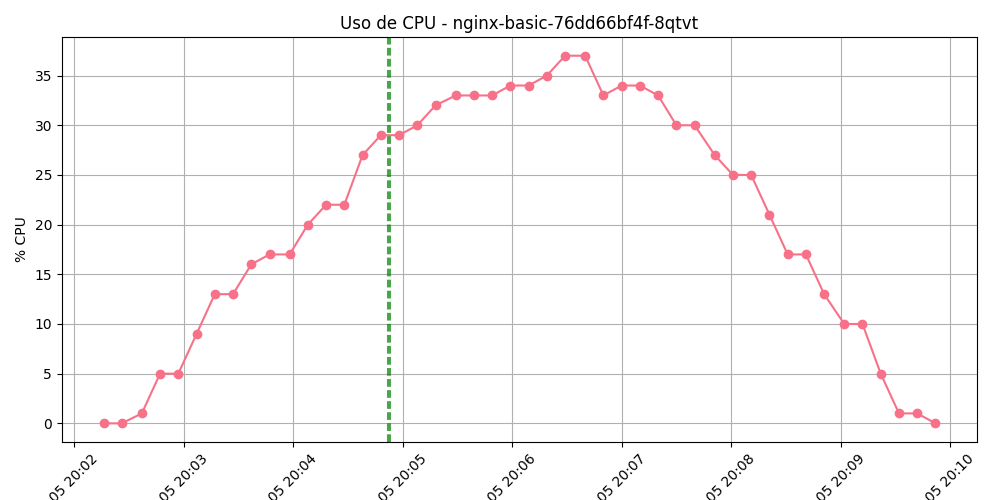
  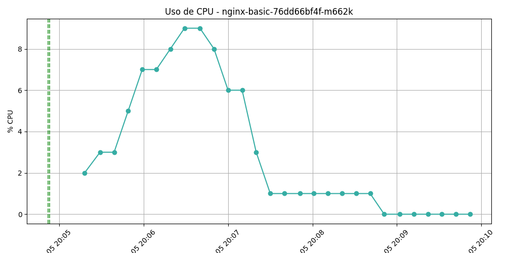

> 🗂️ **Ubicación de las imágenes**: todas estas gráficas se generan automáticamente tras ejecutar el experimento y se almacenan en la carpeta `analysis/images/basic-autoscaling/cpu_pod/`.  
> ⚠️ Los resultados pueden variar levemente dependiendo de las condiciones del entorno de ejecución (capacidad del clúster, latencia de red, etc.).

---

### 🔸 Número de pods activos

Estos gráficos muestran la evolución del número de réplicas del microservicio a lo largo del tiempo. Esta métrica es clave para entender cómo el HPA respondió a la carga generada y en qué momento se activaron o desactivaron nuevas instancias (pods).

#### 🔹 Evolución sin eventos

- **pod_count_over_time.png**  
  En este gráfico se observa que el sistema inicia con una sola réplica, y se mantiene así durante los primeros minutos del experimento. Posteriormente, se incrementa el número de pods a 2, permaneciendo en ese estado hasta el final de la prueba. Esta respuesta refleja la reacción del HPA ante el aumento sostenido del uso de CPU.

  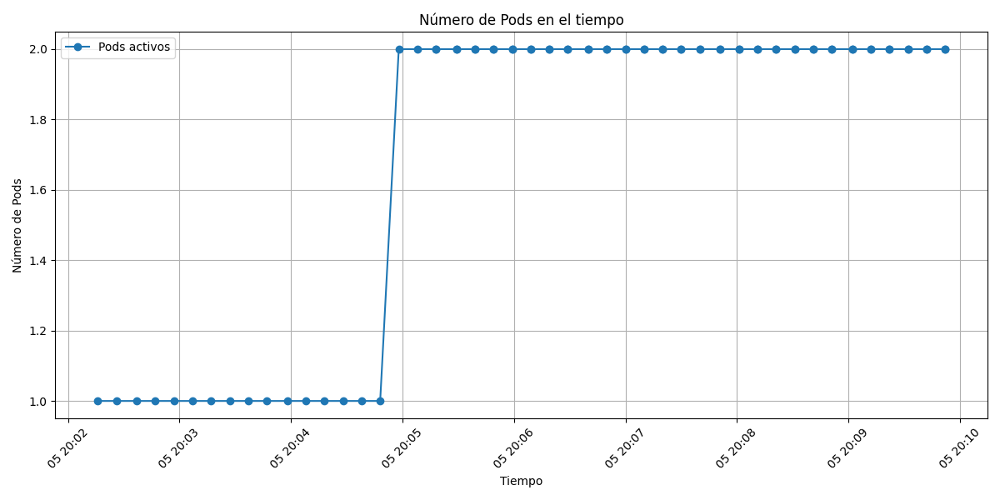

#### 🔹 Evolución con eventos de escalamiento

- **pod_count_over_time_with_events.png**  
  Esta versión incluye líneas verticales que marcan los eventos de escalamiento detectados en el clúster. Se puede apreciar claramente el momento exacto en que ocurre el `scaleup`, lo que ayuda a sincronizar visualmente esta acción con los gráficos de CPU y demanda. No se observa `scaledown`, lo cual indica que el sistema permaneció con dos réplicas hasta el final del experimento.

  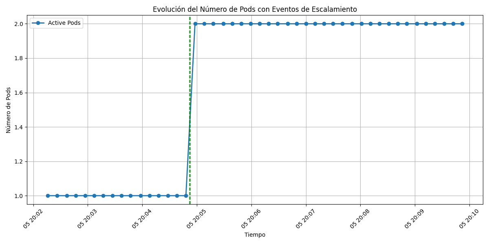

> 🗂️ **Ubicación de las imágenes**: estos gráficos se generan automáticamente y se almacenan en `analysis/images/basic-autoscaling/pod_count/`.  
> ⚠️ La respuesta del HPA puede variar dependiendo de la configuración del clúster y los recursos disponibles en el entorno de ejecución.

---

### 🔸 Curvas de elasticidad

Las siguientes gráficas permiten visualizar la relación entre la demanda estimada de CPU y la oferta real proporcionada por el sistema en cada instante del experimento. Estas curvas son fundamentales para evaluar qué tan eficientemente el sistema respondió al cambio de carga, y en qué medida logró mantenerse cercano a la demanda real sin sobreaprovisionar ni quedar corto de recursos.

Las curvas comparan dos señales:

- **Demanda estimada** (línea roja): calculada a partir del número de VUs o requests y su consumo estimado de CPU según el microbenchmark.
- **Oferta observada** (línea azul): calculada en función del número de réplicas activas y el `CPU request` de cada pod.

Las zonas sombreadas indican:

- **Underprovisioning** (naranja): la demanda supera la oferta → riesgo de degradación del servicio.
- **Overprovisioning** (celeste): la oferta supera la demanda → recursos desaprovechados.

#### 🔹 Basada en VUs

- **elasticity_curve_vu.png**  
  Se observa una demanda creciente en forma de pirámide, con una oferta que responde más lentamente. El área naranja refleja subaprovisionamiento durante gran parte del experimento.

  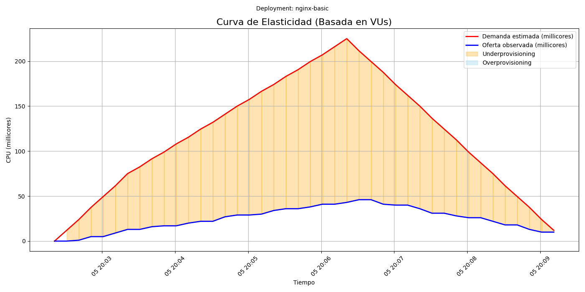

- **elasticity_curve_vus_with_events.png**  
  Esta versión incluye eventos de escalamiento. Se puede ver cómo la oferta comienza a subir luego del evento de `scaleup`, pero no alcanza completamente la demanda, lo cual refleja un retraso característico del HPA.

  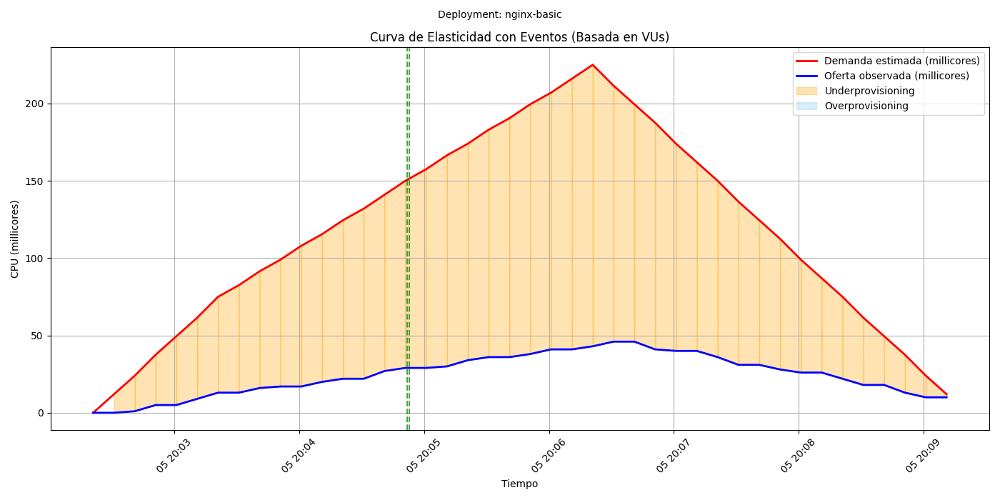

#### 🔹 Basada en requests

- **elasticity_curve_req.png**  
  Esta versión utiliza como base el número real de requests por segundo. La demanda sigue una forma similar pero con menor magnitud. La brecha con la oferta se reduce, aunque sigue existiendo un área importante de subaprovisionamiento.

  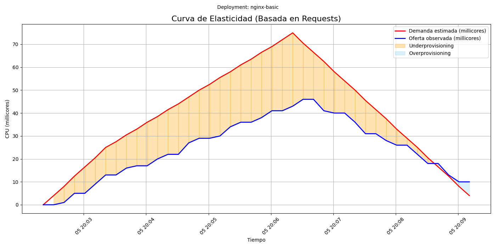

- **elasticity_curve_reqs_with_events.png**  
  Con los eventos marcados, es evidente cómo la oferta mejora su alineación tras el `scaleup`, aunque no se alcanza una coincidencia exacta. Al final del experimento se detecta una ligera zona azul que indica `overprovisioning`.

  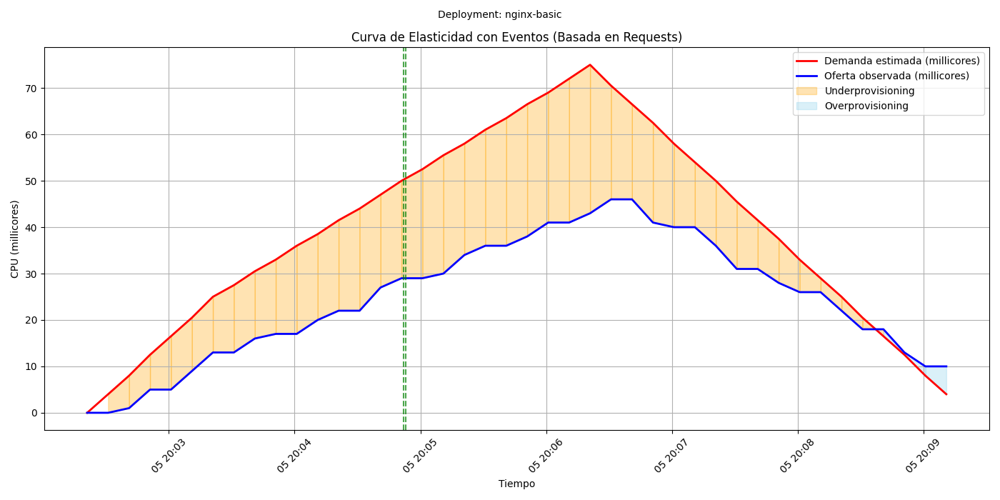

> 🗂️ **Ubicación de las imágenes**: estas gráficas se encuentran en `analysis/images/basic-autoscaling/elasticity/` y se generan automáticamente tras la ejecución del análisis.  
> ⚠️ Las curvas pueden variar en función de los valores definidos en el microbenchmark y del comportamiento puntual del clúster durante el experimento.

---

### 🔸 Métricas complementarias

Además del análisis de uso de CPU y número de pods, también se evaluaron métricas que permiten medir la calidad del servicio entregado por el sistema bajo condiciones variables de carga. Estas métricas fueron recolectadas directamente desde los resultados de k6 y procesadas automáticamente.

#### 🔹 Latencia promedio

- **latency_avg.png**  
  El gráfico muestra una latencia que se estabiliza rápidamente tras un pico inicial, manteniéndose en torno a 500-600 ms durante la mayor parte del experimento. Esto indica un comportamiento estable frente a la carga.

  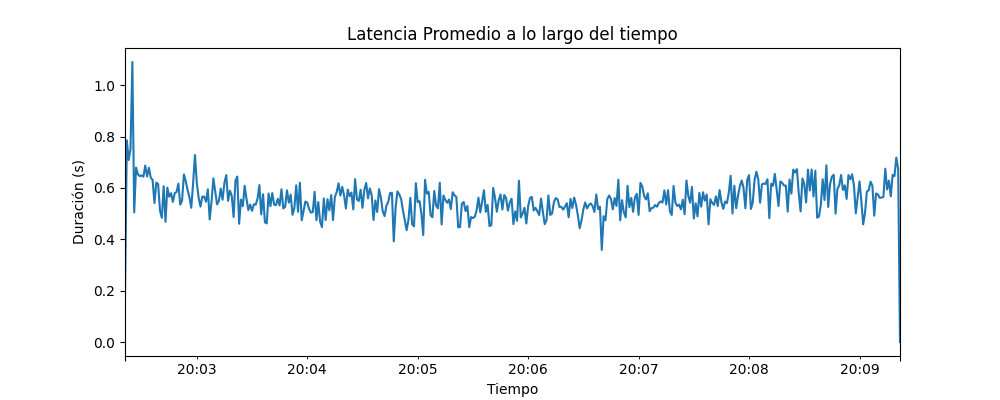

- **latency_avg_events.png**  
  Aquí se aprecia cómo el evento de escalamiento (`scaleup`) ocurre cuando la latencia ya se ha estabilizado, lo que sugiere que el sistema logra mantener buenos tiempos de respuesta incluso antes de escalar.

  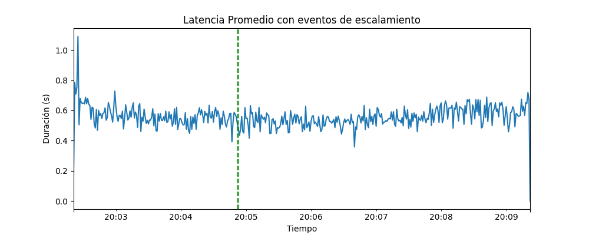

#### 🔹 Throughput total (requests por segundo)

- **throughput.png**  
  La tasa de procesamiento se mantiene constante en 1 request/segundo, lo que concuerda con el diseño del microbenchmark, donde cada VU realiza 1 request por segundo.

  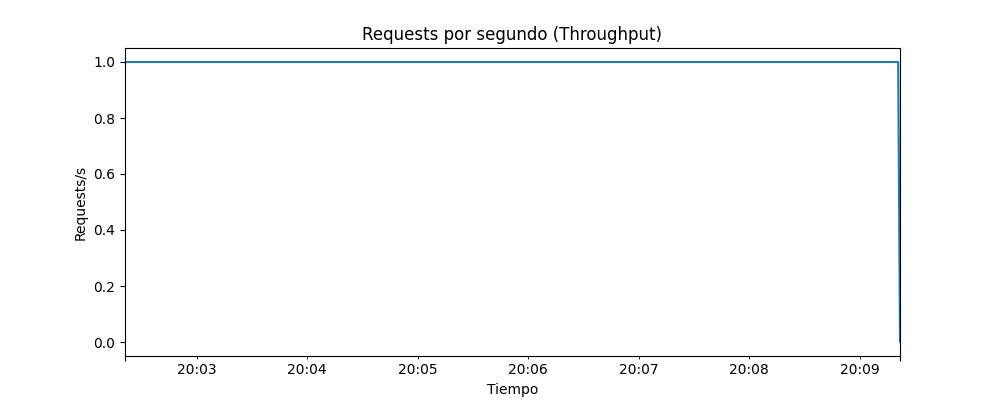

- **throughput_events.png**  
  Esta versión muestra que el escalamiento no afecta la tasa de throughput, confirmando que el sistema fue capaz de sostener la carga sin interrupciones.

  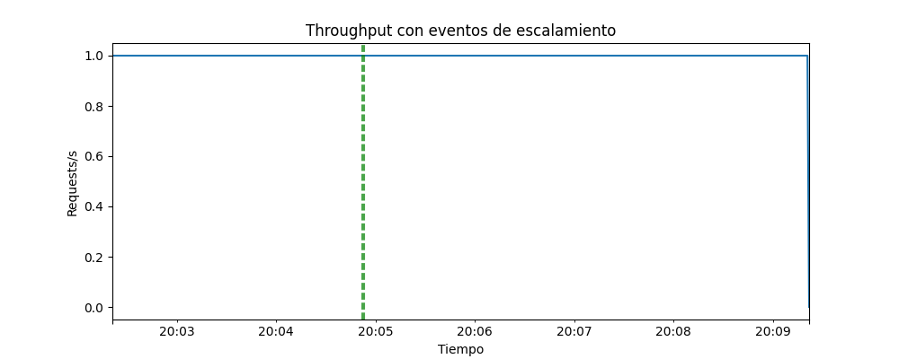

#### 🔹 Relación entre VUs y Throughput

- **throughput_vs_vus.png**  
  El gráfico confirma que el throughput crece de forma lineal con el número de VUs, manteniéndose en 1 request por VU. Esto sugiere una relación directa sin cuellos de botella evidentes.

  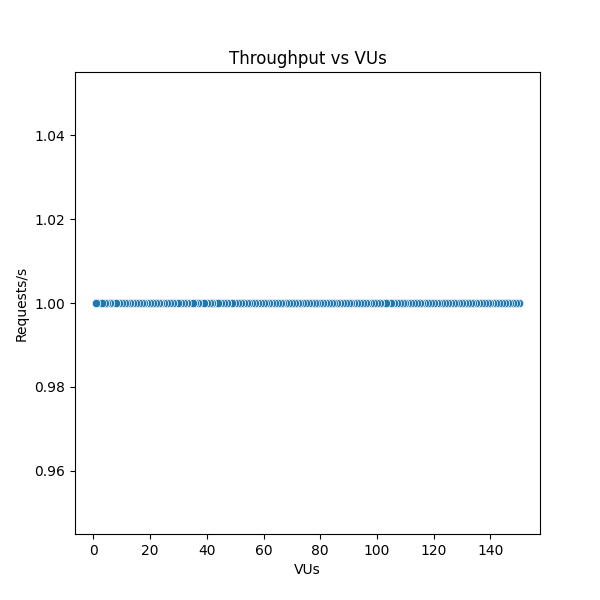

#### 🔹 Errores HTTP

- **http_errors.png**  
  No se registran errores HTTP durante la prueba. La línea permanece en 0, lo cual indica una correcta disponibilidad del servicio bajo carga.

  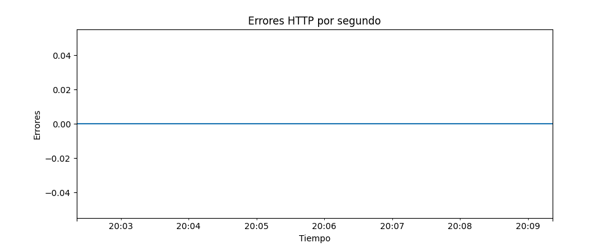

- **http_errors_events.png**  
  El gráfico con eventos corrobora que no hubo errores ni durante ni después del escalamiento, lo que sugiere que el proceso de escalado fue transparente para los usuarios.

  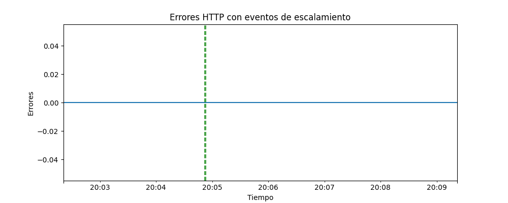

> 🗂️ **Ubicación de las imágenes**: estas gráficas están disponibles en `analysis/images/basic-autoscaling/indirect_metrics/` y se generan automáticamente al ejecutar el análisis del experimento.
> ⚠️ Las curvas pueden variar en función de los valores definidos en el microbenchmark y del comportamiento puntual del clúster durante el experimento.

---

## 📊 Métricas cuantitativas de elasticidad

A continuación se presentan las métricas derivadas del análisis de oferta y demanda de CPU, que permiten cuantificar el nivel de elasticidad alcanzado por el sistema. Se ofrecen dos variantes del cálculo:

- Basado en usuarios virtuales (VUs)
- Basado en número de requests por segundo

Estas métricas se obtienen directamente de los archivos generados por el análisis posterior y permiten comparar el comportamiento del sistema desde dos perspectivas distintas.

---

### 🧮 Definición de métricas de elasticidad

Las siguientes métricas permiten evaluar cuantitativamente el comportamiento elástico del sistema bajo prueba. Se agrupan en bloques para facilitar su comprensión:

#### 🔹 1. Recursos acumulados

- **ΣU (millicore·s)**: CPU faltante acumulada durante períodos de subaprovisionamiento.
- **ΣO (millicore·s)**: CPU excedente acumulada durante períodos de sobreaprovisionamiento.

#### 🔹 2. Tiempos de aprovisionamiento

- **ΣA (s)**: Tiempo total en subaprovisionamiento.
- **A̅ (veces)**: Promedio de ocurrencias en estado subaprovisionado.
- **Ū (millicores)**: CPU promedio faltante.
- **ΣB (s)**: Tiempo total en sobreaprovisionamiento.
- **B̅ (veces)**: Promedio de ocurrencias en estado sobreaprovisionado.
- **Ō (millicores)**: CPU promedio excedente.

#### 🔹 3. Reconfiguración del sistema

- **θ (s)**: Tiempo total en que el sistema cambió de número de pods.
- **Eventos detectados**: bloques de escalado hacia arriba o hacia abajo.

#### 🔹 4. Precisión de escalado

- **Pᵤ (millicore/s)**: Precisión de escalado hacia arriba.
- **P𝑑 (millicore/s)**: Precisión de escalado hacia abajo.

#### 🔹 5. Elasticidad relativa

- **Eᵤ (adimensional)**: Elasticidad de subida.
- **E𝑑 (adimensional)**: Elasticidad de bajada.
- **Eₗ (adimensional)**: Elasticidad global combinada.

#### 🔹 6. Métricas complementarias

- **E (millicore/s)**: Eficiencia global (idealmente cercana a cero).
- **R_U / R_O (millicore/s)**: Sub y sobreaprovisionamiento relativo por segundo.
- **% θ**: Porcentaje del tiempo total que el sistema estuvo reconfigurándose.
- **% tiempo útil**: Tiempo restante operativo sin cambios de configuración.

---

### 🔹 Métricas basadas en VUs

Esta variante estima la demanda a partir del número de VUs activos por segundo (`cpu_per_vu`), representando una visión abstracta del comportamiento.

- **Duración total:** 410 s
- **ΣU / ΣO:** 39000.00 / 0.00 millicore·s
- **ΣA / A̅ / Ū:** 410.00 s / 1.00 / 95.12 millicores
- **ΣB / B̅ / Ō:** 0.00 s / 0.00 / 0.00 millicores
- **Pᵤ / P𝑑:** 95.12 / 0.00 millicore/s
- **Eᵤ / E𝑑 / Eₗ:** 0.0105 / 0.0000 / 0.4415
- **θ:** 1.00 s (0.24 %)
- **E:** –94.1220 millicore/s
- **R_U / R_O:** 95.12 / 0.00 millicore/s
- **% tiempo útil:** 99.76 %

El sistema permaneció todo el experimento en estado de subaprovisionamiento, sin escalar hacia abajo. La baja elasticidad refleja un desfase entre la demanda estimada por VUs y la capacidad de respuesta del HPA.

---

### 🔹 Métricas basadas en Requests

Esta variante estima la demanda usando el throughput real (`cpu_per_req`). Permite una visión más alineada con lo que realmente procesa el sistema.

- **Duración total:** 410 s
- **ΣU / ΣO:** 6260.00 / 100.00 millicore·s
- **ΣA / A̅ / Ū:** 370.00 s / 0.90 / 16.92 millicores
- **ΣB / B̅ / Ō:** 40.00 s / 0.10 / 2.50 millicores
- **Pᵤ / P𝑑:** 15.27 / 0.24 millicore/s
- **Eᵤ / E𝑑 / Eₗ:** 0.0655 / 4.1000 / 2.7075
- **θ:** 1.00 s (0.24 %)
- **E:** –14.5122 millicore/s
- **R_U / R_O:** 15.27 / 0.24 millicore/s
- **% tiempo útil:** 99.76 %

En esta perspectiva se detecta una mayor eficiencia. El sistema logra acercarse más a la demanda real, con presencia tanto de sub como de sobreaprovisionamiento, y mejor respuesta en escalamiento descendente.

---

### 📋 Comparación de métricas

| Métrica                           | Unidad             | VUs                     | Requests                |
|----------------------------------|---------------------|--------------------------|--------------------------|
| ΣU / ΣO                          | millicore·s         | 39000.00 / 0.00          | 6260.00 / 100.00         |
| Ū / Ō                            | millicores          | 95.12 / 0.00             | 16.92 / 2.50             |
| A̅ / B̅                          | veces               | 1.00 / 0.00              | 0.90 / 0.10              |
| Pᵤ / P𝑑                          | millicore/s         | 95.12 / 0.00             | 15.27 / 0.24             |
| Eᵤ / E𝑑 / Eₗ                    | adimensional        | 0.0105 / 0.0000 / 0.4415 | 0.0655 / 4.1000 / 2.7075 |
| θ                                | segundos            | 1.00                     | 1.00                     |
| R_U / R_O                        | millicore/s         | 95.12 / 0.00             | 15.27 / 0.24             |
| % tiempo útil                    | porcentaje          | 99.76 %                  | 99.76 %                  |
| E                                | millicore/s         | –94.1220                 | –14.5122                 |

> 📌 Estas diferencias muestran cómo el enfoque basado en requests puede representar de forma más realista el desempeño del sistema frente a la carga procesada.

---

### 📂 Archivos generados

Los resultados numéricos se encuentran en:

- `basic-autoscaling/output/elasticity_metrics_vus.txt`
- `basic-autoscaling/output/elasticity_metrics_requests.txt`

> ⚠️ **Importante:**  
> Los valores obtenidos pueden cambiar en función de:
> - Los parámetros definidos en el microbenchmark.
> - El comportamiento del clúster al momento de la ejecución.
> - La cantidad y tipo de carga generada por k6.

Es recomendable mantener condiciones constantes entre ejecuciones para hacer comparaciones válidas.

---