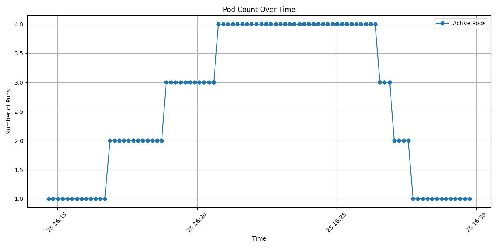
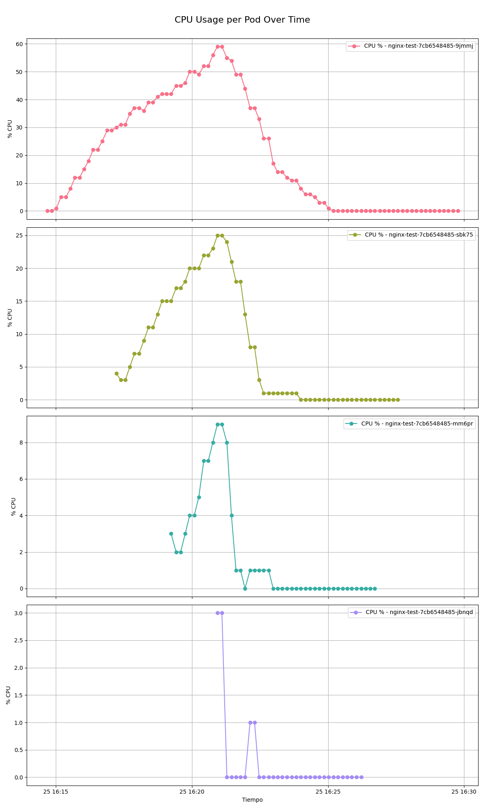
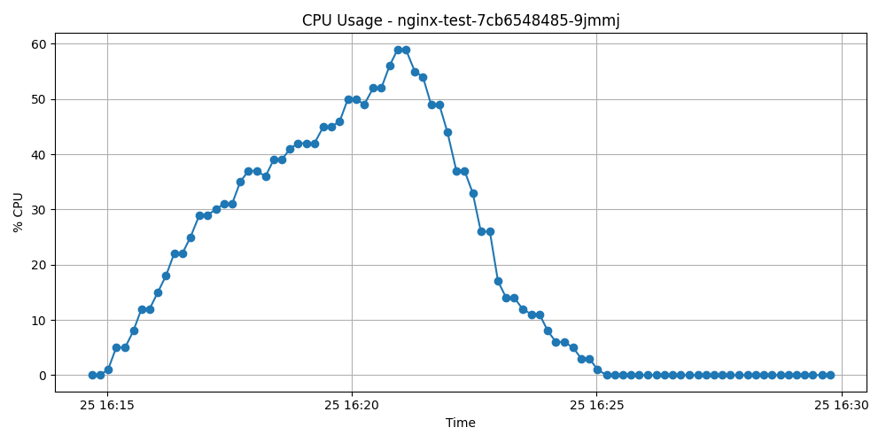
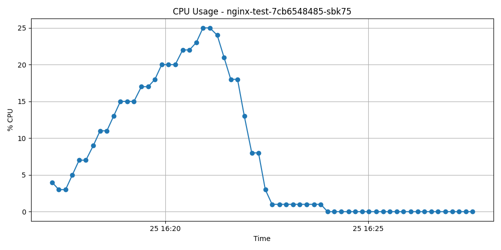
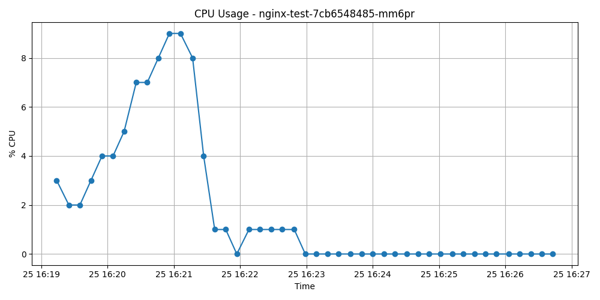
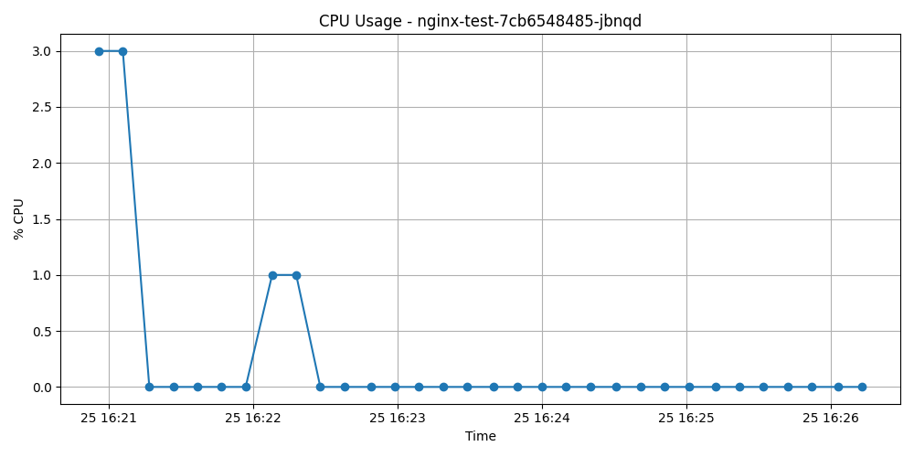

# 📈 Resultados de la Prueba de Carga (Load Test) 🚀

Este documento presenta un análisis detallado de los resultados obtenidos durante la ejecución de una **prueba de carga** sobre un microservicio basado en **NGINX** desplegado en un clúster de **Kubernetes**. El objetivo fue observar el comportamiento del **Horizontal Pod Autoscaler (HPA)** frente a variaciones en la carga de trabajo definida mediante el script `test.js`.

A lo largo del documento se presentan distintos gráficos que ilustran el uso de CPU por pod, la cantidad de pods activos en el tiempo y un desglose individual del consumo de cada uno. Cada sección proporciona observaciones clave sobre el comportamiento del sistema ante la carga inducida.

---

## 🗂️ Índice de contenidos 📚

| Sección | Descripción |
|--------|-------------|
| [1. Escalado de Pods a lo largo del tiempo 🚦](#1-escalado-de-pods-a-lo-largo-del-tiempo-) | Comportamiento del HPA al ajustar el número de réplicas activas según el uso de CPU. |
| [2. Uso de CPU por Pod en el tiempo 🔍](#2-uso-de-cpu-por-pod-en-el-tiempo-) | Análisis agregado del consumo de CPU de todos los pods durante la prueba. |
| [3. Uso de CPU por Pod (detalle) 🧬](#3-uso-de-cpu-por-pod-detalle-) | Desglose individual del comportamiento de cada pod con respecto al uso de CPU. |
| [4. Resumen Ejecutivo 🧠](#4-resumen-ejecutivo-) | Síntesis de los hallazgos clave y dinámica general observada. |
| [5. Conclusiones ✅](#5-conclusiones-) | Observaciones finales sobre la eficiencia del sistema y del proceso de escalado. |

---

## 1. Escalado de Pods a lo largo del tiempo 🚦

La figura anterior ilustra la evolución en el número de **pods activos** en el clúster a lo largo del tiempo durante la ejecución de la prueba de carga. Este comportamiento es orquestado por el **Horizontal Pod Autoscaler (HPA)**, un componente clave de Kubernetes que ajusta dinámicamente el número de réplicas en función del uso de recursos (en este caso, CPU).

Al inicio de la prueba, el sistema comienza con una única réplica del pod. Sin embargo, a medida que la carga generada por el script `test.js` incrementa el uso de CPU, el HPA detecta que se han superado los umbrales establecidos y comienza un proceso progresivo de escalado horizontal.

Los cambios en la cantidad de pods se dan en escalones claramente definidos:

- 🔹 A los pocos minutos, el sistema escala de 1 a 2 pods.
- 🔹 Posteriormente, se incrementa a 3 y luego a 4 réplicas.
- 🔹 Una vez que la carga comienza a disminuir, se revierte este proceso de forma escalonada hasta regresar a una sola instancia.

Este patrón sugiere un comportamiento **estable y eficiente del autoscaler**, evitando picos abruptos o escalados innecesarios. La respuesta temporal entre cada ajuste también indica que se han respetado los períodos de estabilización definidos, lo cual es fundamental para evitar el fenómeno conocido como *flapping* (oscilaciones constantes entre estados).

Este gráfico es clave para contextualizar las secciones siguientes, donde se analiza el uso de CPU individual de cada pod generado por este proceso.

---

## 2. Uso de CPU por Pod en el tiempo 🔍

Este gráfico ofrece una visión consolidada del **uso de CPU (%) por cada pod activo** a lo largo de la prueba. Cada curva representa la trayectoria de consumo de un pod distinto, desde su inicialización hasta su eventual terminación, permitiendo observar la dinámica interna del autoscalado desde una perspectiva de carga computacional.

### Observaciones clave:

- El primer pod (`nginx-test-7cb6548485-9jmmj`) asume toda la carga en las etapas iniciales, alcanzando un uso cercano al 60% antes de que el HPA decida escalar horizontalmente.
- A medida que se incorporan nuevos pods (por ejemplo, `sbk75`, `mm6pr`, `jbnqd`), el consumo se redistribuye de forma progresiva, lo cual refleja una **carga balanceada de manera efectiva** entre las instancias.
- El comportamiento decreciente en el uso de CPU de cada pod una vez que se estabiliza la carga —hasta llegar a cero— evidencia una **desactivación ordenada** cuando la demanda disminuye.
- Los picos de actividad de los pods recién creados nunca alcanzan los niveles del pod original, lo que sugiere que fueron instanciados **reactivamente**, una vez que el sistema detectó una sobrecarga en curso.

En conjunto, esta gráfica confirma que el escalado no solo ocurrió en términos de cantidad de réplicas, sino también de manera eficiente en cuanto a **distribución de carga**. La estrategia de balanceo parece responder de forma oportuna a la demanda simulada.

---

## 3. Uso de CPU por Pod (detalle) 🧬

En esta sección se analiza de forma individual el comportamiento de cada pod en términos de consumo de CPU. Esta vista permite entender con mayor precisión cómo respondió cada instancia ante la carga recibida y cómo se ajustó al entorno dinámico del clúster.

### 3.1 Pod 1: `nginx-test-7cb6548485-9jmmj`

Este fue el primer pod en ser desplegado, y por tanto, asumió toda la carga inicial. Se observa una curva ascendente continua hasta superar el 50% de uso de CPU, lo que eventualmente desencadenó el escalado automático. Su uso disminuye progresivamente conforme otros pods entran en escena, hasta quedar inactivo cuando finaliza la carga. Esta curva es clave para entender el momento exacto en que el sistema detecta la necesidad de escalar.

---

### 3.2 Pod 2: `nginx-test-7cb6548485-sbk75`

Este pod fue desplegado tras alcanzar cierto umbral de carga. La curva muestra un patrón de actividad sostenida, aunque menos pronunciada que la del primer pod. Su activación oportuna ayudó a distribuir la carga, y su consumo decrece en sincronía con el descenso global del sistema. La curva es limpia y refleja un comportamiento esperado dentro de un entorno bien configurado.

---

### 3.3 Pod 3: `nginx-test-7cb6548485-mm6pr`

Este pod muestra un comportamiento más discreto. Aunque entra en funcionamiento en el pico de carga, nunca alcanza valores elevados de CPU. Esto sugiere que su despliegue se produjo cuando la carga ya comenzaba a estabilizarse, actuando más como un **refuerzo puntual** que como un pilar de carga sostenida.

---

### 3.4 Pod 4: `nginx-test-7cb6548485-jbnqd`

El último pod en ser desplegado presenta una curva de uso de CPU muy baja. La actividad que registra es breve y marginal, lo cual indica que su incorporación fue **reactiva**, probablemente como respuesta a un pico momentáneo. Poco después, el sistema lo libera, volviendo al mínimo de una réplica.

---

## 4. Resumen Ejecutivo 🧠

Durante esta prueba de carga, se evaluó el comportamiento del **Horizontal Pod Autoscaler (HPA)** en un entorno Kubernetes frente a una carga progresiva simulada mediante un microservicio basado en NGINX. El objetivo fue verificar la capacidad del sistema para **escalar horizontalmente** de manera automática y eficiente en función del uso de CPU.

A través de la observación de los gráficos, se identificaron tres fases claramente diferenciadas:

1. **Fase de crecimiento:** El pod inicial absorbe toda la carga, provocando un aumento sostenido en el uso de CPU.
2. **Fase de escalado:** El HPA responde al incremento con un escalado progresivo, sumando nuevas réplicas conforme se alcanzan los umbrales definidos.
3. **Fase de estabilización y descenso:** Una vez que la carga comienza a disminuir, el sistema reduce ordenadamente la cantidad de pods hasta regresar a su estado base.

El análisis individual de cada pod refuerza esta dinámica y evidencia una distribución equilibrada de los recursos, junto con una liberación eficiente de instancias innecesarias al disminuir la carga.

---

## 5. Conclusiones ✅

- ⚙️ **El comportamiento del HPA fue adecuado y consistente**, mostrando una capacidad de reacción oportuna tanto en el escalado como en la reducción de pods.
- 📊 El sistema logró **balancear la carga entre los pods activos**, lo que sugiere una correcta configuración de los límites y solicitudes de recursos.
- ⏱️ La **latencia en el escalado** se mantuvo dentro de parámetros esperables, sin sobreescalar, lo que contribuye a la estabilidad del sistema.
- 🧩 El análisis detallado por pod demuestra que **cada instancia tuvo un rol diferenciado**, ajustándose a la necesidad puntual del sistema en cada etapa.
- 🧼 La limpieza del entorno tras la prueba —con la reducción a una sola réplica— evidencia un **uso eficiente de los recursos**, evitando el consumo innecesario post-carga.

En conjunto, los resultados confirman que el autoscaler cumple con su propósito en un escenario realista de demanda variable, manteniendo un **buen equilibrio entre rendimiento, eficiencia y escalabilidad**.

---
